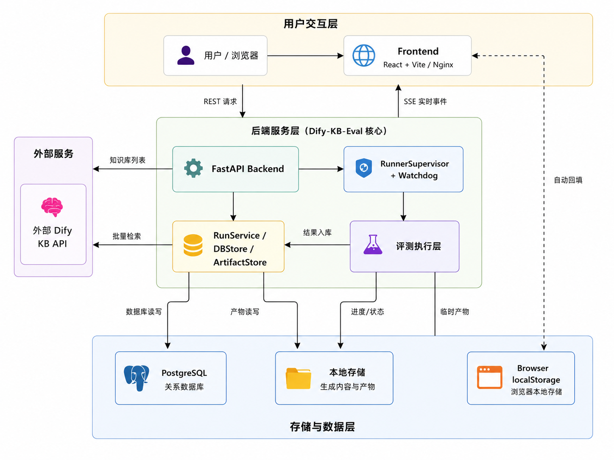

# Dify-KB-Eval

Language: [简体中文](README.md) | English

Dify-KB-Eval is a standalone retrieval quality evaluation platform for Dify knowledge bases. It brings dataset management, Dify Knowledge Base API calls, retrieval metric calculation, failure analysis, and cross-run comparison into a single tool — useful for engineering, QA, and delivery-time validation of knowledge-base recall.

Run metadata is stored in the project's bundled PostgreSQL database. Evaluation datasets, retrieval details, and downloaded artifacts are kept in local project directories. To run an evaluation you only need a Dify API base URL, a Dify API Key, and a target knowledge base.

## Highlights

| Capability | Description |
| --- | --- |
| Dify knowledge-base retrieval | Connects directly to the Dify Knowledge Base API for KB listing, matching, and Top K retrieval |
| Dify connection configs | Stores Dify API URL and Key pairs in the backend database for auto-fill after refresh, dropdown reuse, and deletion |
| Dataset generation | Generates JSONL samples from PDF / Markdown sources; PDFs are parsed with local MarkItDown |
| Human review gate | Auto-generated samples enter `draft` first and must be marked `reviewed` in the editor before evaluation |
| Metrics | Calculates document, section, keyword, and content hits, plus Recall, MRR, Precision, NDCG, empty-result rate, and latency |
| Run tracking | FastAPI backend executes evaluations asynchronously; the frontend watches progress over SSE, and failed samples plus logs are traceable |
| Cross-run comparison | Compares embedding / rerank labels, Top K, and sample sizes on the same dataset |
| Local artifacts | Produces `results.jsonl`, `results.csv`, `console.log`, and other downloadable artifacts; summaries and report bodies are stored in the database |
| Docker deployment | Supports one-click container deployment and offline packages; backend, frontend, and PostgreSQL run on a dedicated Docker network |
| Unified logging | Backend, runner subprocesses, and request links write to `logs/`; logs are auto-tagged with `request_id` / `run_id` for easier troubleshooting |

## When To Use

Use it to answer questions like:

- Before a new knowledge base goes live, does Top K stably recall the correct documents and sections?
- After switching embedding, rerank, or chunking strategy, did recall, MRR, and latency improve?
- Which questions, documents, or scenario types fail recall most often?
- For the same evaluation dataset, which Dify knowledge-base configuration is best suited for delivery?

## Architecture




| Content | Location |
| --- | --- |
| Run status, progress, metric summaries, Markdown report body | PostgreSQL |
| Per-query retrieval details, CSV, console logs | `reports/<run_id>/` |
| Main datasets, generated datasets, drafts, review metadata | `datasets/`, `datasets/generated/` |
| Uploaded source documents and intermediate Markdown | `generated_sources/` |

## Feature Map

| Area | Main purpose |
| --- | --- |
| Evaluation | Enter or pick a historical Dify connection, fetch knowledge bases, configure Top K, sample limit, comparison labels, and start a run |
| Datasets | View JSONL files under `datasets/` and `datasets/generated/`, generate drafts from PDF / Markdown sources, and back up before deletion |
| Dataset editor | Edit rows, inspect validation errors, save drafts or main files, and submit human review |
| Run detail | Watch progress over SSE, inspect failed samples, metrics, Markdown reports, and downloadable artifacts |
| Run history | Browse runs by status and Dify URL, with rename, delete, and cancel support |
| Analysis / Compare | Group completed runs on the same dataset and compare embedding / rerank labels, Top K, sample sizes, and composite scores |

## Quick Start

### Requirements

- Python `>= 3.12,<3.14`
- [uv](https://docs.astral.sh/uv/)
- Node.js and npm
- Docker — optional but recommended for local PostgreSQL or container deployment
- An indexed Dify knowledge base
- A Dify Knowledge Base API Key

### One-command local start

If `.env` does not exist yet, copy the example configuration first:

```powershell
Copy-Item .env.example .env
```

Start the backend, frontend, and local database:

```powershell
.\start.ps1
```

Or in `cmd`:

```cmd
start.bat
```

The script checks for `uv` / `npm`, starts PostgreSQL when Docker is available, installs missing dependencies, and starts each service separately:

- Backend: `http://127.0.0.1:8200`
- Frontend: `http://127.0.0.1:5598`. If `DEV_PORT` is configured in `frontend/.env` or `frontend/.env.local`, that port takes precedence.

To preview only the frontend without depending on the backend, database, or Dify, enable mock mode:

```powershell
.\start.ps1 -Mock
```

Or:

```cmd
start.bat -Mock
```

Linux / macOS:

```bash
cp .env.example .env
bash ./start.sh
```

`start.sh` runs the backend and frontend together in the foreground by default. Press Ctrl+C to stop both at once. To preview only the frontend without depending on the backend or Dify:

```bash
bash ./start.sh --mock
```

### Manual start

Start PostgreSQL and the backend:

```powershell
Copy-Item .env.example .env
docker compose up -d db
uv sync
uv run uvicorn backend.app:app --reload --host 127.0.0.1 --port 8200
```

Linux / macOS:

```bash
cp .env.example .env
docker compose up -d db
uv sync
uv run uvicorn backend.app:app --reload --host 127.0.0.1 --port 8200
```

> On Windows, `uv run uvicorn` occasionally errors with `uv trampoline failed to canonicalize script path`. When that happens, invoke the uvicorn module directly through the venv Python:
>
> ```powershell
> .venv\Scripts\python.exe -m uvicorn backend.app:app --reload --host 127.0.0.1 --port 8200
> ```

Open another terminal for the frontend:

```powershell
cd frontend
npm install
$env:VITE_API_BASE_URL = "http://127.0.0.1:8200"
npm run dev
```

Linux / macOS:

```bash
cd frontend
npm install
VITE_API_BASE_URL="http://127.0.0.1:8200" npm run dev
```

Open the Vite local URL in your browser; by default it is `http://127.0.0.1:5598`.

## Docker Deployment

### Online one-click deployment

If you want to fully deploy the backend, frontend, and PostgreSQL as containers, run this from the project root:

```powershell
.\deploy-docker.ps1
```

Linux / macOS:

```bash
bash ./deploy-docker.sh
```

The deploy script automatically builds the backend / frontend images, starts the `db` / `backend` / `frontend` services, and opens the browser once `http://127.0.0.1:5598/api/health` becomes reachable.

It creates the `dify-kb-eval-net` network by default. Inside the network, services can reach each other through `db:5432`, `backend:8200`, or by container name (`dify-kb-eval-db`, `dify-kb-eval-backend`).

For a fresh PostgreSQL on first deploy, you do not need to create tables manually: the Postgres container creates the database per `POSTGRES_DB`, the backend entrypoint waits for the database to be ready, detects an empty database, auto-creates the current ORM schema, and runs Alembic `stamp head`. The relevant switches are `RUN_DB_INIT_ON_EMPTY=true` and `RUN_DB_STAMP_HEAD_ON_INIT=true` in `.env`.

Default mirror sources:

| Type | Default |
| --- | --- |
| Docker base image | `m.daocloud.io/docker.io/library/...` |
| apt | `mirrors.aliyun.com` |
| PyPI | `https://mirrors.aliyun.com/pypi/simple/` |
| npm | `https://registry.npmmirror.com` |

To switch mirrors, copy `.env.example` to `.env` and override `POSTGRES_IMAGE`, `PYTHON_IMAGE`, `NODE_IMAGE`, `NGINX_IMAGE`, `APT_MIRROR`, `PYPI_INDEX_URL`, `NPM_REGISTRY`, and similar variables.

Stop the containers:

```powershell
.\deploy-docker.ps1 -Down
```

### Offline deployment package

Offline deployment is a two-step process: build the offline package on a network-connected machine first, then copy the package to an offline machine and load/run it. Both the build machine and the offline machine only need Docker Desktop / Docker Engine installed and running. The offline machine does not need Python, uv, Node.js, or npm.

Windows build machine:

```powershell
cd C:\Users\17651\Desktop\AI2\Dify-KB-Eval
.\build-offline-package.ps1
```

After the build completes, the offline package is written to:

```text
C:\Users\17651\Desktop\AI2\Dify-KB-Eval\offline-packages\
```

The file name looks like:

```text
dify-kb-eval-offline-20260625-153000.zip
```

To specify a delivery version:

```powershell
.\build-offline-package.ps1 -Tag v1.0.0
```

Linux / macOS build machine:

```bash
bash ./build-offline-package.sh
```

The script builds the backend / frontend images, pulls the PostgreSQL image, exports all three images to `offline-packages/dify-kb-eval-offline-<timestamp>/images/*.tar`, and generates the offline package. The package bundles:

```text
images/
  backend.tar
  frontend.tar
  postgres.tar
docker-compose.offline.yml
.env.offline
deploy-offline.ps1
deploy-offline.sh
datasets/
docs/
config/
```

Copy the offline package to an offline Windows machine, unzip it, then run from the unzipped directory:

```powershell
.\deploy-offline.ps1
```

Linux / macOS machine:

```bash
bash ./deploy-offline.sh
```

The offline deploy script runs `docker load` to load the images, then starts the services with a `pull_policy: never` compose file. It does not access the public network. The default URL is still `http://127.0.0.1:5598`.

First-start in an offline environment also auto-initializes an empty PostgreSQL — no extra SQL or Alembic commands are required.

To include historical run artifacts and uploaded source files in the package:

```powershell
.\build-offline-package.ps1 -Tag v1.0.0 -IncludeRuntimeData
```

## Basic Workflow

1. Prepare a Dify knowledge base and confirm that document indexing is complete.
2. Start this project's PostgreSQL, backend, and frontend.
3. Place existing JSONL files under `datasets/` or `datasets/generated/`, or generate a dataset from PDF / Markdown on the **Datasets** page.
4. Open the dataset editor, review each row, and submit the review.
5. Return to **Evaluation**, fill in the Dify API base URL and Dify API Key.
6. Pick the target knowledge base from the **KB** dropdown; embedding / rerank comparison labels are filled automatically.
7. Run a small smoke test first, for example `limit=3`, and confirm the pipeline and report work.
8. Set the sample limit to `0` for a full evaluation.
9. On the detail page, review metrics, failed samples, the report, and the downloadable artifacts.
10. On the **Analysis / Compare** page, compare multiple runs on the same dataset. Focus on the composite score, grade, risks, weak spots, and rationale.

`limit=0` means no sample limit.

## Dataset Format

Datasets are UTF-8 JSONL files, one sample per line. Minimal example:

```json
{
  "id": "KB-EVAL-001",
  "vendor": "Example Vendor",
  "model": "Example Model",
  "scenario_type": "Failure Recovery",
  "topic": "Console password recovery",
  "difficulty": "Medium",
  "question": "How do I recover a lost Console password?",
  "alternative_queries": [
    "What if I forget the Console password?"
  ],
  "expected_documents": [
    "01-01 Common System Operations.pdf"
  ],
  "expected_sections": [
    "Recovering a lost Console login password"
  ],
  "expected_keywords": [
    "Console",
    "password recovery"
  ],
  "evaluation_focus": "Should hit the password-recovery section and include the key recovery steps."
}
```

Review states:

| State | Meaning |
| --- | --- |
| `unreviewed` | Historical samples or no review record has been written yet |
| `draft` | A draft is pending review and cannot be used to create an evaluation run |
| `reviewed` | Human review is complete and the dataset can be used for evaluation |

For the full field specification and quality requirements see [docs/数据集规范.md](docs/数据集规范.md).

## Dataset Generation

The project can generate datasets from PDF / Markdown in a directory or uploaded through the browser. Recommended source layout:

```text
Example Vendor/Example Model/
  01-01 Common System Operations.pdf
  01-02 Common Maintenance Operations.pdf
  md/
    01-01 Common System Operations.md
    01-02 Common Maintenance Operations.md
```

The page supports selecting a folder that contains PDF / Markdown files, and it also supports uploading a single PDF. Browser-uploaded source files are saved under `generated_sources/<vendor>/<model>/`; generated Markdown is saved in its `md/` subdirectory.

PDF parsing is fixed to the local MarkItDown package or CLI and does not depend on an external parsing service. When `reuse_existing_markdown` is enabled, the service reuses same-name Markdown first and only calls MarkItDown when no matching Markdown exists. You can set a custom CLI template through the request field `markitdown_command` or the `MARKITDOWN_COMMAND` environment variable.

Generated results are written to `datasets/generated/` by default. New samples are first saved as `<name>.draft.jsonl`; after review they overwrite the main JSONL and write `<name>.review.json`.

## Metrics

For the configured Top K the evaluator generates `@1`, `@3`, `@5`, and current-K metrics, and outputs grouped statistics by `scenario_type`.

| Metric | Meaning |
| --- | --- |
| `document_recall@k` | Whether Top K hits an expected document |
| `section_recall@k` | Whether Top K hits an expected section, including aliases and slash-separated variants |
| `keyword_recall@k` | Whether Top K satisfies the expected keyword condition |
| `content_recall@k` | Whether document, section, or keyword matching succeeds |
| `content_precision@k` | Ratio of content hits among Top K results |
| `content_ndcg@k` | Normalized discounted cumulative gain based on hit position |
| `*_mrr` | Mean reciprocal rank for each hit type |
| `empty_result_rate` | Ratio of queries that returned no retrieval results |
| `avg_latency_ms` / `p95_latency_ms` | Average and P95 latency for successful queries |
| `error_queries` | Number of queries that failed when calling Dify |

Strict paragraph-level recall requires the dataset to label all acceptable answers. The current implementation uses document, section, and keyword rules to produce `content_hit`.

### Composite Scoring Model

The Analysis / Compare page generates a composite score for delivery decisions on top of the raw metrics. It does not replace the detailed metrics — it consolidates the common judgement criteria into a single line so that you can quickly rank multiple embedding / rerank / Top K results.

| Component | Description |
| --- | --- |
| Content quality | Uses `content_recall@5`, `content_mrr`, `content_ndcg@5` as the main signals; falls back to Document metrics when Content metrics are missing |
| Auxiliary hits | Incorporates Section / Document / Keyword recall and ranking signals so that you do not only look at content hits while ignoring section localization and keyword coverage |
| Risk penalty | Penalizes `empty_result_rate`, `error_queries`, unfinished queries, high P95 latency, and too-small sample sizes |
| Grade | Outputs `Excellent`, `Usable`, `Usable with risk`, `Unusable`, or `Missing metrics`, plus risk tags such as `Pass`, `Review needed`, `Blocker` |
| Rationale | Surfaces the main weak spots, risk items, and key metric summaries in the table and exports so you can see why a particular row is the best candidate |

The in-group best row and the CSV / Excel exports all use the same composite scoring logic. To adjust the weights, edit `frontend/src/pages/runCompareScoring.ts` and update `runCompareScoring.test.mjs`.

## Configuration

Copy `.env.example` and adjust as needed:

```powershell
Copy-Item .env.example .env
```

Common settings:

| Variable | Description |
| --- | --- |
| `DATABASE_URL` | Backend database URL. Defaults to local PostgreSQL exposed by `docker-compose.yml`: `127.0.0.1:5555` |
| `RUN_DB_BOOTSTRAP` | Can be `true` in dev; container deployment auto-initializes an empty database by default |
| `RUN_DB_MIGRATIONS` | When set to `true`, the backend container entrypoint runs `alembic upgrade head` before starting. Default `true` (the fallback in `docker-compose*.yml` and the container entrypoint script is still `false`, so for offline deployment you must explicitly pass `true` via `.env` / `.env.offline` for migrations to run) |
| `RUN_DB_INIT_ON_EMPTY` | Auto-create tables when an empty database is detected on container startup |
| `RUN_DB_STAMP_HEAD_ON_INIT` | Mark the Alembic version to head after auto-creating tables on an empty database |
| `LOG_LEVEL` | Log level: `DEBUG`, `INFO`, `WARNING`, `ERROR` |
| `LOG_DIR` / `LOG_TO_FILE` | Log directory and whether to write to file |
| `LOG_MAX_BYTES` / `LOG_BACKUP_COUNT` | Log rotation size and backup count |
| `MARKITDOWN_COMMAND` | Optional MarkItDown CLI template with `{input}` / `{output}` placeholders |
| `EVAL_RUNNER_CONCURRENCY` | Runner subprocess concurrency, default `8` |
| `EVAL_RUNNER_TICK_MS` | Runner queue polling interval, default `500` |
| `EVAL_RUNNER_SUBPROCESS` | Set to `disabled` to fall back to inline backend execution |
| `POSTGRES_IMAGE` | PostgreSQL image used by Docker / offline package |
| `PYTHON_IMAGE` / `NODE_IMAGE` / `NGINX_IMAGE` | Base images used to build the backend and frontend images |

The frontend proxies to `http://127.0.0.1:8200` by default. To override:

```powershell
cd frontend
$env:VITE_API_BASE_URL = "http://127.0.0.1:8200"
npm run dev
```

The Dify API URL and Key are stored as plaintext pairs in the backend database connection history, so the page can auto-fill after refresh and reuse previous configs from the dropdown. The backend does not write the token to run artifacts, report bodies, or public run configuration, but you should still only use real credentials on a trusted local machine or trusted intranet environment.

## Logs

File logging is enabled by default. The directory is controlled by `LOG_DIR`; when unset, logs are written to `logs/`:

| File | Content |
| --- | --- |
| `logs/backend.log` | FastAPI start/stop, HTTP requests, database initialization, runner supervisor / watchdog status |
| `logs/backend.error.log` | Backend exceptions and 5xx-related errors |
| `logs/runner.log` | Runner subprocess startup, queue claiming, per-run start / completion / failure |
| `logs/runner.error.log` | Runner subprocess exceptions |
| `reports/<run_id>/console.log` | User-facing execution log and retrieval summary for a single evaluation |

HTTP request logs include `request_id`, and the response header also returns `X-Request-ID`. Evaluation execution logs include `run_id`, so when troubleshooting you can copy the run id from the frontend and cross-search `logs/runner.log`, `logs/backend.log`, and `reports/<run_id>/console.log`.

## API Overview

The backend defaults to `http://127.0.0.1:8200`. All business APIs use the `/api` prefix.

| Method | Path | Description |
| --- | --- | --- |
| `GET` | `/api/health` | Health check |
| `GET` | `/api/datasets` | List datasets |
| `POST` | `/api/datasets/generate` | Generate a dataset from server-accessible paths |
| `POST` | `/api/datasets/generate/upload` | Upload source documents and generate a dataset |
| `DELETE` | `/api/datasets/{path:path}` | Delete a dataset along with its draft and review metadata |
| `GET` / `PUT` | `/api/dataset-rows/{path}` | Read or save dataset rows |
| `POST` | `/api/dataset-rows/{path}/review` | Submit human review |
| `GET` | `/api/dataset-rows/{path}/export` | Export JSONL text |
| `GET` | `/api/knowledge-bases` | Fetch Dify knowledge-base list |
| `GET` | `/api/dify-connections` | List historical Dify connection configs |
| `POST` | `/api/dify-connections` | Save a Dify API URL and Key pair |
| `DELETE` | `/api/dify-connections/{config_id}` | Delete a historical connection config |
| `POST` | `/api/runs` | Create an evaluation run |
| `GET` | `/api/runs` | List historical runs |
| `GET` | `/api/runs/compare` | Cross-run comparison data |
| `GET` | `/api/runs/{run_id}` | Run detail |
| `GET` | `/api/runs/{run_id}/events` | SSE run progress |
| `PATCH` | `/api/runs/{run_id}` | Rename a run |
| `POST` | `/api/runs/{run_id}/labels` | Update embedding / rerank comparison labels |
| `GET` | `/api/runs/{run_id}/report` | Get Markdown report |
| `GET` | `/api/runs/{run_id}/artifacts/{name}` | Download run artifacts |
| `DELETE` | `/api/runs/{run_id}` | Delete or cancel a run |
| `POST` | `/api/langsmith/datasets/sync` | Optional: sync a LangSmith dataset |
| `POST` | `/api/langsmith/experiments/run` | Optional: create a LangSmith experiment run |

For complete request and response contracts see [docs/API契约.md](docs/API契约.md).

## Project Structure

```text
Dify-KB-Eval/
├── backend/                  # FastAPI routes, Pydantic schemas, database, services
│   ├── app.py                # App entry, lifespan, API routes, SSE
│   ├── db/                   # SQLAlchemy session, ORM models, Alembic
│   └── services/             # Run, dataset, artifact, LangSmith, runner services
├── config/                   # MinerU and other configuration examples
├── datasets/                 # JSONL evaluation datasets
│   └── generated/            # Auto-generated datasets
├── docker/                   # Container entrypoint scripts
├── docs/                     # Design, API, specification, and operation docs
├── frontend/                 # React + TypeScript + Vite frontend
│   ├── Dockerfile            # Frontend production image build
│   ├── nginx.conf            # Static file serving and /api reverse proxy
│   └── src/
├── generated_sources/        # Uploaded source files and intermediate Markdown
├── kb_eval/                  # Dify client, runner, metrics, reports, parsers
├── reports/                  # Run artifacts and delete backups
├── scripts/                  # Migration and maintenance scripts
├── tests/                    # Backend and core logic tests
├── Dockerfile                # Backend image build
├── docker-compose.yml        # PostgreSQL + backend + frontend full container stack
├── docker-compose.offline.yml # Offline deployment compose, no build / pull
├── deploy-docker.*           # Docker one-click deploy / stop scripts
├── build-offline-package.*   # Build offline deployment package
├── deploy-offline.*          # Load images and start on an offline machine
├── pyproject.toml            # Python project dependencies
├── start.ps1 / start.bat / start.sh   # One-command local start scripts
└── verify.ps1 / verify.bat / verify.sh # Verification scripts
```

## Verification

Run the unified verification before submitting or delivering:

```powershell
.\verify.ps1
```

Linux / macOS:

```bash
bash ./verify.sh
```

The verification script runs, in order:

- `uv sync`
- Backend and core logic unittest
- MarkItDown availability check
- Frontend helper tests
- Frontend production build

Skip the sync when dependencies are already up to date:

```powershell
.\verify.ps1 -SkipSync
```

```bash
bash ./verify.sh --skip-sync
```

You can also run the checks individually:

```powershell
uv run python -m unittest discover
cd frontend
npm run test:helpers
npm run build
```

## Troubleshooting

### Page cannot load knowledge bases

Check the Dify API URL and API Key. Dify typically uses an API root such as `http://localhost/v1`, and the key must have Knowledge Base API access.

### Start evaluation button is disabled

Common causes: the current dataset is not `reviewed`, no target knowledge base is selected, or the Dify API URL / Key is incomplete. Complete dataset review in the editor first, then return to **Evaluation**.

### Run fails with model service unavailable

This kind of error usually comes from the model service, rerank service, or plugin call behind Dify. Try lowering Top K, increasing the timeout, or pausing other concurrent evaluations, then retry.

### Database startup fails

Confirm PostgreSQL is running and that the `DATABASE_URL` in `.env` matches the port exposed by `docker-compose.yml`. Container deployment to an empty database will create tables automatically; if you turn off `RUN_DB_INIT_ON_EMPTY`, you need to initialize the schema yourself.

### Historical runs or the home page returns 500

First hit `http://127.0.0.1:8200/api/health` directly to check whether the backend is alive. If the health check passes but `/api/runs` still returns 500, the database schema is usually out of sync with the current code. Run:

```powershell
uv run alembic current
uv run alembic heads
uv run alembic upgrade head
```

After the upgrade, hit `/api/runs?limit=1&offset=0` again. If the issue persists, search for the `request_id` in `logs/backend.error.log`.

## Documentation

- [Operation Manual](docs/操作手册.md)
- [API Contract](docs/API契约.md)
- [Dataset Specification](docs/数据集规范.md)
- [Persistence Design](docs/持久化设计.md)
- [Technical Selection & Comparison](docs/技术选型与对比.md)

---

Suzhou Yunrong Information Technology Co., Ltd. is sponsoring this project.
