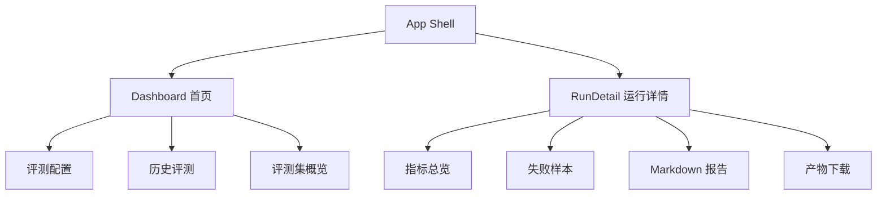

# Dify-KB-Eval 前端页面设计

## 1. 视觉方向

前端是独立内部工具，但视觉上延续现有 蓝白运维控制台风格。

参考方向：现有蓝白运维控制台里的系统管理、知识库管理页面风格。

建议视觉关键词：

- 背景：`#f8fafd`
- 主色：`#0066FF`
- 文本主色：`#1e2e44`
- 辅助文本：`#64748b`
- 边框：`#e2e8f0`
- 卡片：白底、轻阴影、圆角 `12-16px`
- 状态色：成功绿色、失败红色、运行中蓝色、警告琥珀色

页面顶部要明确标注：

```text
内部知识库评测工具，非客户交付功能
```

## 2. 信息架构



建议路由：

| 路由 | 页面 | 说明 |
|---|---|---|
| `/` | Dashboard | 发起评测、查看历史评测 |
| `/runs/:runId` | RunDetail | 查看单次评测详情 |

## 3. Dashboard 页面

布局建议：

```text
┌─────────────────────────────────────────────────────────────┐
│ Header: Dify 知识库评测 | 内部工具 | Dify 状态             │
├───────────────────────┬─────────────────────────────────────┤
│ 评测配置表单           │ 评测集概览 + 推荐基线                │
│ - Dify API 地址         │ - 样本数 / 厂商 / 型号               │
│ - Token 临时输入       │ - 场景分布                           │
│ - Dataset ID           │ - 推荐 TopK                          │
│ - 评测集               │                                     │
│ - Top K / Limit        │                                     │
│ - Embedding / Rerank   │                                     │
│ - 开始评测按钮         │                                     │
│ - 开始评测按钮         │                                     │
├───────────────────────┴─────────────────────────────────────┤
│ 历史评测列表                                                 │
└─────────────────────────────────────────────────────────────┘
```

核心组件：

- `RunConfigForm`：评测配置表单。
- `DatasetSummaryCard`：显示评测集样本数、厂商、型号、场景分布。
- `BaselineHintCard`：显示推荐阈值，例如 `document_recall@5 >= 85%`。
- `RunHistoryTable`：历史评测列表。

## 评测集编辑器页面（/datasets/{path}/editor）

评测集概览卡上"打开编辑器"按钮进入独立路由 `/datasets/<path>/editor`，把 JSONL 解析为可编辑表格，便于人工复核与修改。

### 页面结构

```text
┌──────────────────────────────────────────────────────────────┐
│ 编辑：<name> · <path>                                        │
├──────────────────────────────────────────────────────────────┤
│ 行数 / 原始样本数 / 本地告警 / 服务端错误                    │
│ [搜索] [场景过滤] [+ 新增行] [JSONL 预览] [下载原文件] [保存] │
├──────────────────────────────────────────────────────────────┤
│ 样本表格（行高自适应；行点击展开详情抽屉）                   │
│  列：ID / 厂商 / 型号 / 场景 / 主题 / 难度 / 主问题 /         │
│       评估关注点 / 期望文档 / 期望章节 / 期望关键词 / 同义问法│
│       / 操作                                                 │
├──────────────────────────────────────────────────────────────┤
│ 第 N 行详情：主问题预览 / 评估关注点 / 期望字段回顾 /         │
│             "其他元数据" JSON 透传 textarea                   │
└──────────────────────────────────────────────────────────────┘
```

### 交互要点

- 每个单元格直接编辑；列表字段（`expected_documents` / `expected_sections` / `expected_keywords` / `alternative_queries`）以 tag 形式呈现，回车或逗号新增、`×` 删除。
- 单元格保存前预校验：必填字段缺失、ID 重复、列表字段为空都会在单元格上以红框 + 行内提示渲染，但本地校验不阻断保存。
- 点击"保存到 JSONL"提交 `PUT /api/datasets/{path}/rows`，服务端 422 时把行级 `validation_errors` 投射回对应单元格（红框 + 文案）。
- 覆盖原文件前自动生成 `<file>.jsonl.bak`（已存在累加 `.bak2`、`.bak3`），可手动回退。
- "查看 JSONL"模态框显示编辑后即将落盘的 JSONL；"下载当前编辑结果"输出 `.edited.jsonl` 备份。
- 搜索 + 场景过滤只影响表格可见行，不会改动数据集内容。
- "新增行"插入空模板；删除行通过行尾红色垃圾桶按钮。
- `StatusBadge`：状态标签。

表单字段：

| 字段 | 控件 | 默认值 |
|---|---|---|
| Dify API 地址 | Input | `http://localhost/v1` |
| Dify API Key | Password Input | 必填 |
| 评测集 | Select | `huawei_s1720` |
| Dataset ID | Input | 空，表示自动匹配 |
| Top K | Select/Input | `5` |
| 样本上限 | Input | `20`，正式跑可设为 `0` |
| 同义问法 | Switch | 关闭 |
| Embedding 标签 | Input | 选 KB 后自动回填并只读 |
| Rerank 标签 | Input | 选 KB 后自动回填并只读 |

交互规则：

- 点击“开始评测”后调用 `POST /api/runs`。
- 成功后跳转到 `/runs/:runId`。
- 表单提交期间禁用按钮，展示“已创建任务，正在进入详情”。
- Dify API 地址和 Key 成对保存在后端数据库的历史连接配置中，用于刷新后自动回填和下拉复用。

## 4. RunDetail 页面

布局建议：

```text
┌─────────────────────────────────────────────────────────────┐
│ 返回 | 运行名称 | 状态 | 创建时间 | Embedding / Rerank 标签 | 操作 |
├─────────────────────────────────────────────────────────────┤
│ 指标卡片: Doc@5 | MRR | 空结果率 | 平均耗时 | 错误数          │
├─────────────────────────────────────────────────────────────┤
│ 进度条 / 当前样本 / 已完成 query 数                          │
├─────────────────────────────────────────────────────────────┤
│ Tabs: 失败样本 | Markdown 报告 | 场景指标 | 产物下载           │
└─────────────────────────────────────────────────────────────┘
```

指标卡片：

| 指标 | 展示 |
|---|---|
| `document_recall@5` | 百分比，大号数字 |
| `document_mrr` | 三位小数 |
| `empty_result_rate` | 百分比，超过阈值标红 |
| `avg_latency_ms` | `ms` |
| `error_queries` | 整数 |

失败样本表：

| 列 | 说明 |
|---|---|
| 样本 ID | `sample_id` |
| 主题 | `topic` |
| Query | 实际查询 |
| 命中位次 | `doc_hit_rank`，未命中显示 `未命中` |
| Top1 文档 | 召回第一条文档 |
| 期望文档 | `expected_documents` |
| 错误 | Dify 或评测错误 |

报告 Tab：

- 调用 `GET /api/runs/{run_id}/report`。
- 渲染 Markdown。
- 提供“复制报告”和“下载 report.md”。

产物下载：

- `report.md`
- `summary.json`
- `results.jsonl`
- `results.csv`
- `console.log`

## 5. 轮询状态

详情页轮询：

```text
queued/running: 每 2 秒 GET /api/runs/{run_id}
completed/failed/canceled: 停止轮询
```

如果浏览器离开页面，不需要继续轮询。回到历史评测列表时通过 `GET /api/runs` 获取最新状态。

## 6. 前端类型建议

```ts
export type EvalRunStatus = "queued" | "running" | "completed" | "failed" | "canceled";

export interface EvalRunListItem {
  id: string;
  name: string;
  status: EvalRunStatus;
  created_at: string;
  finished_at?: string | null;
  duration_ms?: number | null;
  eval_file: string;
  dataset_id?: string;
  top_k: number;
  sample_count: number;
  query_count: number;
  metrics: {
    "document_recall@5"?: number;
    document_mrr?: number;
    empty_result_rate?: number;
    avg_latency_ms?: number;
  };
  embedding_model?: string | null;
  rerank_model?: string | null;
}
```

## 7. Mock 数据策略

前端可先不等后端完成，使用本地 mock：

- `GET /api/datasets` 返回 1 个 S1720 评测集。
- `GET /api/runs` 返回 2-3 条历史评测记录。
- `POST /api/runs` 返回 `queued` 的 `run_id`。
- `GET /api/runs/{run_id}` 前 2 次返回 `running`，第 3 次返回 `completed`。

Mock 数据字段必须与 [API 契约](API契约.md) 保持一致。

## 8. 验收标准

- 页面视觉与现有蓝白控制台一致，但明确是独立内部工具。
- 可以通过表单创建评测运行。
- 可以展示运行中进度和终态结果。
- 可以查看失败样本和 Markdown 报告。
- 可以下载全部产物。
- Dify API 地址和 Key 成对写入后端历史连接配置表；不写入报告或下载产物。
- 移除或替换 mock 后，无需改页面结构即可接后端。
