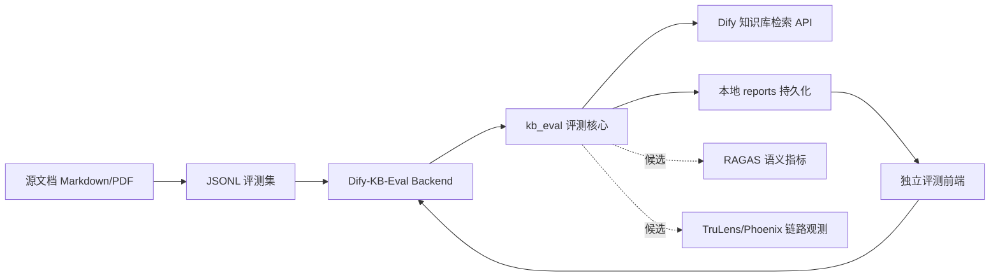

# 知识库评测项目技术选型与对比

更新日期：2026-06-09

## 1. 结论

`Dify-KB-Eval` 当前推荐采用"自建评测核心 + 独立前后端 + PostgreSQL 元数据 + 本地报告产物"的方案。

核心原因不是成熟工具不好，而是 Dify 知识库评测有很强的项目特性：

- 评测对象是 Dify 背后的知识库召回能力，第一阶段更关注"源文档是否被召回、章节内容是否命中、关键配置点是否出现"，而不是只看最终回答质量。
- 评测数据来自处理后的 Markdown 源文本，但实际知识库文档可能是 PDF，例如 `MinerU_markdown_01-01 常见系统操作.md` 对应知识库中的 `01-01 常见系统操作.pdf`，因此必须支持自定义文档名映射和命中规则。
- 评测系统是独立工具，不应耦合进其他业务前端或业务后端。
- 项目需要可迁移到其他知识库项目中，所以评测核心、后端服务、前端页面和报告产物应保持独立目录边界。
- 不依赖外部实验追踪平台，敏感知识库文档、客户问题、Token 不上传到外部服务。

因此,应优先把"可重复评测、可看结果、可保存报告、可定位失败样本"做扎实;后续再按需要评估 RAGAS、TruLens、Phoenix 等指标或观测能力是否值得引入。

## 2. 当前项目定位

`Dify-KB-Eval` 是内部知识库评测系统，用于研发、测试、交付前验证知识库质量。

它不属于客户交付功能，主要服务这些场景：

- 新建或重建知识库后，验证基础召回质量是否达标。
- 调整切分策略、Embedding、Rerank、Top K、Dify 知识库配置后做回归对比。
- 对华为 S1720 等设备文档生成固定评测集，沉淀基线。
- 定位“应该召回哪个文档但没有召回”的失败样本。
- 给研发、测试、项目交付人员提供可复盘的 Markdown/JSON/CSV 报告。

当前已经形成的项目边界:

```text
Dify-KB-Eval/
  backend/      独立 FastAPI 后端
  frontend/     独立 React/Vite 前端
  kb_eval/      可复用评测核心
  datasets/     JSONL 评测集
  reports/      本地评测报告产物，不纳入 Git
  docs/         设计、接口、操作、选型文档
```

## 3. 当前技术选型

| 层级 | 选型 | 作用 | 选择原因 |
| --- | --- | --- | --- |
| 评测核心 | Python 模块 `kb_eval` | 读取评测集、调用 Dify、计算指标、生成报告 | 与后端和 CLI 复用，便于迁移 |
| 后端服务 | FastAPI + Pydantic | 提供任务创建、状态查询、报告读取、产物下载 API | 轻量、开发快、接口契约清晰，适合内部工具 |
| 包管理 | uv + Python 3.12 | 管理 Python 依赖和运行环境 | 环境创建快，命令统一，便于 Windows 开发 |
| 前端 | React + Vite + TypeScript | 发起评测、查看历史、展示指标、查看报告 | 独立前端，开发体验好，风格可延续现有项目 |
| 元数据 | PostgreSQL 16 | 存 `runs` / `run_summaries` / `run_reports`，支持按 dataset / 标签高效过滤 | 自带 `docker compose up -d db`，不接客户业务库 |
| 报告产物 | 本地 `reports/<run_id>/` 文件 | 保存 `results.jsonl`、`results.csv`、`console.log` | 明细和日志走文件，元数据走 DB |
| 外部系统 | Dify API | 调用知识库检索能力 | 将目标知识库当作黑盒，降低与业务系统耦合 |

当前指标重点：

- `document_recall@1/3/5/top_k`：目标文档是否被召回。
- `content_recall@1/3/5/top_k`：文档、章节或关键内容任一命中时视为内容命中。
- `section_recall@k`：目标章节是否命中。
- `keyword_recall@k`：关键配置项、命令、参数是否命中。
- `document_mrr`、`content_mrr`：命中结果越靠前分数越高。
- `empty_result_rate`：空召回比例。
- `avg_latency_ms`、`p95_latency_ms`：平均耗时和 P95 耗时。
- `by_scenario_type`：按安装、配置、故障、规格、操作等场景拆分指标。

## 4. 与主流方案对比

| 工具 | 上手成本 | 自定义程度 | 可视化 | 适合场景 | 相对我们方案的关系 |
| --- | --- | --- | --- | --- | --- |
| RAGAS | 低 | 中 | 有现成生态或外部集成 | 通用 RAG 指标评估 | 可作为语义评估指标库补充，不适合作为当前唯一评测系统 |
| TruLens | 中 | 中 | 强，偏 tracing 和 feedback 结果查看 | 调试 RAG/LLM pipeline 每一步 | 适合定位链路问题，但对项目文档级召回准入不够直接 |
| Arize Phoenix | 中 | 高 | 强,偏可观测性、实验、trace | 开源 LLM 可观测平台、跨框架调试 | 适合中后期统一观测平台,当前引入成本偏高 |
| LangSmith | 中 | 高 | 强 | LangChain/LangGraph 生态下的 tracing、dataset、experiment | 依赖外部服务和 API Key,目前未接入 |
| 自建方案 | 高但可控 | 最高 | 自己画，已做前端页面 | 有特殊评估需求、需要文档映射、准入基线、内部交付前验证 | 当前主方案，负责评测闭环和项目特有逻辑 |

## 5. 我们相对各工具的优缺点

### 5.1 相对 RAGAS

RAGAS 的优势：

- 上手快，提供大量 RAG 常用指标，适合快速评估回答相关性、上下文召回、忠实度等通用问题。
- 不需要一开始自建完整评测框架，适合做概念验证。
- 可作为后续 LLM-as-judge 或语义评估的指标来源。

我们的优势：

- 更贴合当前第一阶段目标：验证“知识库是否把正确源文档和内容召回来”。
- 能处理项目特有的文档映射，例如 Markdown 源文档名和 Dify/PDF 知识库文档名不一致。
- 召回明细里可以保留确切 `document_id`、`document_name`、rank、score、content preview，方便直接定位 Dify 知识库问题。
- 指标可按厂商、型号、场景类型拆分，更适合网络设备文档知识库验收。

我们的不足：

- 通用语义指标不如 RAGAS 完整。
- 若要评估最终回答的 faithfulness、answer relevance、answer correctness，还需要继续扩展。
- 自建指标需要持续校准，避免命中规则过宽或过窄。

建议关系：

RAGAS 不替代当前系统,后续可作为 `kb_eval` 的可选评估器,用于回答质量评估。

### 5.2 相对 TruLens

TruLens 的优势：

- 强在 tracing 和 feedback functions，能记录和观察每一次应用调用。
- 内置 Streamlit dashboard，可看 leaderboard、单条 trace 和 feedback 结果。
- 适合调试 RAG pipeline 中每一步，例如检索、上下文选择、回答生成、groundedness。

我们的优势：

- 当前评测对象是 Dify 知识库检索 API，不要求侵入 LangChain pipeline 内部。
- 更轻量，不需要为每个链路节点做 instrumentation。
- 输出报告更贴合项目验收，报告结构、字段和失败样本可按交付习惯定制。
- 对“重建知识库后是否退化”这类回归任务更直接。

我们的不足：

- 链路级调试能力弱于 TruLens，无法天然看到每个 chain/span 的内部状态。
- 缺少成熟的 feedback dashboard 和人工反馈能力。
- 如果后续要排查“召回正确但回答错误”的问题，需要补 tracing 或接入外部工具。

建议关系：

TruLens 更适合用于开发调试,不适合作为当前主评测系统。若后续需要细粒度调试 LangChain pipeline,可引入为开发侧辅助工具。

### 5.3 相对 Arize Phoenix

Phoenix 的优势：

- 开源 AI observability 和 evaluation 平台，适合 tracing、evaluation、prompt engineering、datasets & experiments。
- 基于 OpenTelemetry/OpenInference，跨框架和跨语言能力较强。
- 适合做统一观测平台，能服务多个应用、多个模型、多个实验。

我们的优势：

- 部署和使用成本更低，不需要额外维护观测平台。
- 更适合当前小团队快速闭环：配置一次评测，得到本地报告和页面结果。
- 指标和数据结构完全围绕 Dify 知识库准入设计。
- 不会因为引入平台而改变当前 Dify 的部署结构。

我们的不足：

- 没有 Phoenix 那种成熟的跨应用 trace、prompt 实验、生产观测能力。
- 不适合做长期多项目、多模型、多团队统一可观测平台。
- 如果要做线上流量采样、生产 trace 评估、跨应用实验对比，自建成本会升高。

建议关系：

Phoenix 可以作为中后期"统一 AI 可观测平台"的候选。如果只是做 Dify 知识库离线准入评测,使用 Phoenix 会偏重。

### 5.4 实验追踪 / 跨配置对比

跨配置对比在 KB-Eval 内部完成 (`/api/runs/compare` + 分析对比页):

- 按 `dataset_id` 过滤,可选附加 `top_k`
- 按 `(embedding_model, rerank_model, sample_count)` 三元组分组
- 每组计算 `best_run_id`: Recall@5 高 → MRR 高 → 耗时短
- 历史 run 标签支持二次修正 (`POST /api/runs/{id}/labels`)

这套机制不依赖外部服务,UI 和指标完全按项目团队习惯设计,敏感知识库文档、客户问题、Token 不上传到外部平台。

## 6. 为什么不是直接选一个成熟平台

直接使用成熟平台会遇到几个项目现实问题：

- 当前第一阶段不是通用问答评测，而是检索准入评测。我们需要精确知道“哪个文档、哪个章节、哪个关键配置点被召回”。
- 源文档和知识库文档存在名称差异，必须在评测集里显式维护 `expected_documents`、`expected_sections`、`expected_keywords` 等字段。
- 评测系统不应进入客户交付前后端，需要独立部署、独立迁移、独立版本管理。
- 评测报告要能本地留存，方便排查 Dify 知识库删文档、重建索引、召回异常等问题。
- 团队已经需要一个前端页面展示结果，而不是只在 notebook、命令行或第三方 dashboard 中查看。

因此，当前最合适的路线是：

```text
自建系统负责项目闭环
成熟工具负责可选增强
```

## 7. 推荐演进路线

### 内部可用闭环

目标是稳定完成“发起评测、查看结果、保存报告、定位失败样本”。

已覆盖或应优先覆盖：

- 独立 FastAPI 后端。
- 独立 React/Vite 前端。
- JSONL 评测集规范。
- Dify 检索 API 适配。
- 文档、章节、关键字、内容命中指标。
- 历史评测列表和详情页面。
- 本地 `reports/` 持久化。
- PostgreSQL 元数据 + 同 dataset 跨配置对比。

### 实验增强（候选能力）

尚未实现、需要时再评估的方向：

- 多次运行差异对比，例如基线版本 vs 重建知识库版本。
- 数据集版本记录，例如 S1720 v1、S1720 v2。
- 更明确的失败原因分类，例如文档缺失、文档名不匹配、召回靠后、内容切分不完整、Dify 返回异常。
- 可选接入 RAGAS 的回答质量指标。

### 可观测和生产化（候选能力）

尚未实现、需要时再评估的方向：

- 接入 Phoenix 或 TruLens 做链路级 tracing。
- 支持线上 query 采样生成回归样本。
- 增加人工标注和复核流程。
- 增加 CI 回归阈值，例如 `content_recall@5 < 85%` 时阻断发布。

## 8. 风险与控制

| 风险 | 表现 | 控制方式 |
| --- | --- | --- |
| 自建维护成本 | 指标、页面、报告格式都要自己维护 | 保持核心模块小而清晰，成熟能力通过 adapter 接入 |
| 指标误判 | 文档名匹配或关键字匹配过宽导致虚高 | 数据集维护 `expected_documents`、`expected_sections`、`expected_keywords`，并保留召回明细人工复核 |
| 与真实知识库不一致 | 源 Markdown 名和实际 PDF 名不一致 | 在评测集规范中明确“源文档名”和“知识库文档名”映射 |
| 第三方平台依赖 | 外部服务不可用或有数据合规顾虑 | 本地 `reports/` + PostgreSQL 元数据作为主存储 |
| 只看召回不看回答 | 召回正确但最终回答仍可能错误 | 后续评估是否加入 RAGAS 或 LLM-as-judge 回答质量指标 |
| 只做离线评测 | 评测集可能不能覆盖真实用户问法 | 后续从线上 query 或测试反馈中持续补充样本 |

## 9. 推荐最终架构



## 10. 参考资料

- RAGAS 官方指标文档：https://docs.ragas.io/en/latest/concepts/metrics/available_metrics/
- TruLens Dashboard 文档：https://www.trulens.org/getting_started/dashboard/
- TruLens 核心概念文档：https://www.trulens.org/getting_started/core_concepts/
- Arize Phoenix 官方文档:https://arize.com/docs/phoenix
