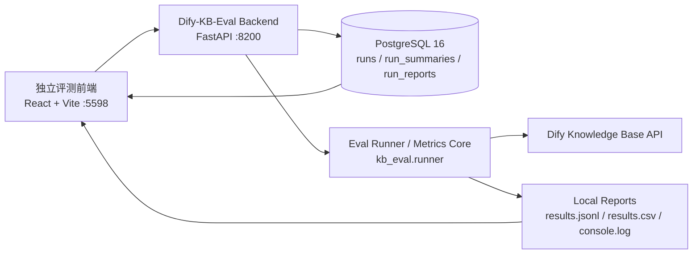

# 独立知识库评测系统设计概要

## 1. 定位

`Dify-KB-Eval` 是内部研发 / 测试使用的知识库评测系统,用于在客户交付前验证知识库检索质量、对比不同切块 / Embedding / Rerank 配置、沉淀回归基线。

系统独立于其他业务前后端:

- 不注册到业务前端的系统管理页面
- 不注册到业务后端的 API
- 不使用业务系统数据库迁移链
- 可作为独立目录迁移到其他项目

## 2. 范围与现状

目标是做"可用、可复盘、可迁移"的内部评测系统。**当前实现已经覆盖**:

- 前端"评测台 / 历史评测 / 分析对比 / 评测集"四个页面
- 后端异步执行评测任务,PostgreSQL 元数据 + 3 个磁盘产物
- 历史评测列表、详情、跨配置对比、标签修正、改名、软删 + 备份
- 选 KB 后自动回填 embedding / retrieval 标签
- 评测集审核状态机:`unreviewed` / `draft` / `reviewed`

**当前不包含**(刻意不做):

- 不做客户产品内菜单
- 不接客户业务数据库
- 不做复杂权限体系
- 不做多租户
- 不做长期趋势大屏,先保留数据结构
- 不接外部实验追踪平台(不依赖 LangSmith 等)

## 3. 总体架构



说明:

- 前端只连接 `Dify-KB-Eval Backend`
- Backend 调用现有 Dify 知识库检索 API,不侵入 Dify
- 元数据走 PostgreSQL,检索明细和日志走文件
- 删除运行是软删除 + 一次性 `reports/<id>.deleted-<UTC>/` 备份

## 4. 推荐目录

```text
Dify-KB-Eval/
  README.md
  pyproject.toml
  docker-compose.yml         # 自带 PostgreSQL 16
  datasets/
    huawei_s1720.jsonl
    generated/
  docs/
    设计概要.md
    API契约.md
    数据集规范.md
    前端页面设计.md
    开发任务拆分.md
    持久化设计.md
    操作手册.md
  backend/
    app.py
    schemas.py
    db/                      # SQLAlchemy 引擎、Session、模型
    services/
      run_service.py
      db_store.py
      artifact_store.py
      dataset_generation_service.py
      dataset_edit_service.py
      dataset_review_service.py
  frontend/
    index.html
    src/
      App.tsx
      pages/                 # Home / Runs / RunDetail / RunCompare / Datasets / DatasetEditor
      widgets/               # Field / StatusBadge / ConfirmDialog / 等
  kb_eval/
    runner.py
    metrics.py
    dataset.py
    dify_client.py
    report.py
    mineru_api.py
    markitdown_converter.py
  reports/
    <run_id>/
      results.jsonl
      results.csv
      console.log
    <run_id>.deleted-<UTC>/  # 一次性备份
  tests/
```

## 5. 前端分工

前端保持现有项目蓝白运维控制台风格,但作为独立系统实现。已实现的页面:

- `Home`(评测台):评测配置表单 + 历史摘要
- `Runs`(历史评测):分页列表,支持改名、修改标签、删除
- `RunDetail`:指标卡片 + 失败样本 + Markdown 报告 + 检索明细
- `RunCompare`(分析对比):同 `dataset_id` 下按 (embedding, rerank, sample_count) 分组对比,自动高亮 best
- `Datasets` + `DatasetEditor`:评测集列表 + 行级编辑 + 审核

核心交互:

- 选择评测集
- 输入 Dify API 地址
- 在"选 KB"下拉里挑目标知识库,`embedding_model` / `retrieval_model_dict` 自动回填
- 设置 Top K、样本上限、是否纳入同义问法
- 点击"开始评测"
- 轮询运行状态(每 2s 一次)
- 查看报告详情
- 下载 `results.jsonl` / `results.csv` / `console.log`

前端注意:

- Token / API Key 不应长期保存在 localStorage；Dify 连接历史由后端数据库按 URL + Key 成对保存
- 默认只面向 localhost 或内网使用
- 页面中明确标注"内部评测工具,非客户交付功能"

## 6. 后端分工

后端使用 FastAPI + 同步 SQLAlchemy,作为独立内部服务。

职责:

- 管理评测任务生命周期
- 调用评测 runner
- 调用 Dify 知识库检索接口
- 读写 PostgreSQL 元数据
- 维护 3 个磁盘产物
- 返回历史报告和详情
- 透传 `/api/knowledge-bases`,供前端"选 KB"下拉

建议 API(完整列表见 [API 契约](API契约.md)):

```http
GET  /api/health
GET  /api/datasets
GET  /api/knowledge-bases
GET  /api/runs
GET  /api/runs/compare
POST /api/runs
GET  /api/runs/{run_id}
PATCH /api/runs/{run_id}                      # 改名
POST /api/runs/{run_id}/labels                # 改对比标签
GET  /api/runs/{run_id}/report
GET  /api/runs/{run_id}/artifacts/{name}      # 3 个白名单文件之一
DELETE /api/runs/{run_id}                     # 软删除 + 备份
```

`POST /api/runs` 请求示例:

```json
{
  "name": "Huawei S1720 知识库 (BGE-Embedding + BGE-Rerank) Top5 基线评测",
  "dify_base_url": "http://localhost/v1",
  "dify_api_key": "kb-secret",
  "dataset_id": "dify-dataset-id",
  "eval_file": "datasets/huawei_s1720.jsonl",
  "top_k": 5,
  "include_alternatives": false,
  "limit": 20,
  "sample_ids": [],
  "timeout_seconds": 60,
  "embedding_model": "bge-large-zh-v1.5",
  "rerank_model": "bge-reranker-v2-m3"
}
```

`GET /api/runs/{run_id}` 返回示例(节选):

```json
{
  "id": "20260609-113000-s1720-top5",
  "name": "Huawei S1720 知识库 (BGE-Embedding + BGE-Rerank) Top5 基线评测",
  "status": "completed",
  "created_at": "2026-06-09T11:30:00+08:00",
  "finished_at": "2026-06-09T11:31:12+08:00",
  "summary": {
    "overall": {
      "document_recall@5": 0.91,
      "document_mrr": 0.78,
      "empty_result_rate": 0.0,
      "avg_latency_ms": 1230
    }
  },
  "artifacts": [
    {"name": "results.jsonl", "type": "jsonl", "url": "/api/runs/.../artifacts/results.jsonl"},
    {"name": "results.csv",   "type": "csv",   "url": "/api/runs/.../artifacts/results.csv"},
    {"name": "console.log",   "type": "log",   "url": "/api/runs/.../artifacts/console.log"}
  ],
  "embedding_model": "bge-large-zh-v1.5",
  "rerank_model": "bge-reranker-v2-m3"
}
```

## 7. 评测核心分工

评测核心保持纯 Python,可被 CLI、Backend 共同复用。

模块:

- `dataset.py`:读取 JSONL、校验字段、过滤样本
- `dify_client.py`:封装 Dify 知识库列表和检索 API
- `metrics.py`:文档命中、章节命中、关键词命中、MRR、空结果率、耗时
- `runner.py`:执行完整评测流程
- `report.py`:生成 `report.md` / `summary.json` / `results.csv` / `results.jsonl`
- `mineru_api.py` + `markitdown_converter.py`:两套 PDF 解析后端(并存,`pdf_parser` 字段切换)

核心指标:

- `document_recall@1/3/5`
- `section_recall@5`
- `keyword_recall@5`
- `content_recall@k`(文档 / 章节 / 关键词任一命中)
- `content_precision@k`
- `content_ndcg@k`
- 对应 `*_mrr`
- `empty_result_rate`
- `avg_latency_ms`
- `p95_latency_ms`

后续候选指标(尚未实现):

- LLM-as-judge retrieval relevance
- answer groundedness / answer relevance

## 8. 报告持久化

采用 "PostgreSQL 元数据 + 3 个磁盘产物" 混合持久化,完整字段与读写时序见 [持久化设计](持久化设计.md)。

```text
reports/<run_id>/
  results.jsonl
  results.csv
  console.log
```

`manifest.json` / `summary.json` / `report.md` 跑完会被搬到 PostgreSQL 三张表,磁盘副本清理。

## 9. 详细设计文档

为便于团队分工,详细约束拆到以下文档:

- [API 契约](API契约.md):后端接口、请求响应、轮询策略、错误格式
- [数据集规范](数据集规范.md):JSONL schema、样本质量要求、审核状态机
- [前端页面设计](前端页面设计.md):页面结构、视觉风格、组件拆分、mock 策略
- [开发任务拆分](开发任务拆分.md):现状与候选、任务优先级、验收用例
- [持久化设计](持久化设计.md):PostgreSQL 表 + 磁盘产物目录结构
- [操作手册](操作手册.md):安装、启动、发起评测、查看报告和常见问题

## 10. 前后端任务拆分

前端任务(已实现 + 持续打磨):

- 四个主页面骨架与路由
- 评测配置表单、运行轮询、详情页
- 历史评测列表(分页 / 状态过滤 / 改名 / 改标签 / 软删)
- 分析对比页(分组、最优 run 高亮、跨 dataset 切换)
- 评测集列表 + 行级编辑 + 审核
- Mock 模式(`VITE_USE_MOCK=true`)脱离后端预览

后端任务(已实现 + 持续打磨):

- FastAPI 服务 + SQLAlchemy 三张表
- 评测任务生命周期、状态机、软删
- 评测集审核 / 草稿状态机
- Dify 知识库列表透传 + 选 KB 后的标签回填
- 历史评测改名、对比标签修改(独立窄接口)
- 一次性备份目录的软删除
- 同步 SQLAlchemy + `psycopg` 同步驱动

评测 / 算法任务:

- 维护 JSONL schema 与字段校验
- 校验 S1720 / 新增厂商型号评测集质量
- 定义基线阈值(对比页 best run 即基于阈值 + 耗时排序)
- 设计 PDF 解析后端选型策略(MinerU vs MarkItDown)

## 11. 现状与候选

按"现在就能用 / 现在还做不到"两栏写,避免分期口吻。

### 11.1 已实现

- 独立 FastAPI 后端 + 同步 SQLAlchemy,三张表 `runs` / `run_summaries` / `run_reports`
- 评测集审核状态机:`unreviewed` / `draft` / `reviewed`,未审核禁止创建 run
- 评测任务后台执行 + 进度实时回写 + 前端每 2s 轮询
- 跑完把 `summary.json` / `report.md` 从磁盘搬到 DB,清理磁盘副本
- 3 个可下载磁盘产物:`results.jsonl` / `results.csv` / `console.log`
- `/api/knowledge-bases` 透传 Dify,前端"选 KB"下拉
- 选完 KB 自动回填 `embedding_model` / `retrieval_model_dict` 到运行表单并只读
- `/api/runs/compare` 按 `(embedding_model, rerank_model, sample_count)` 分组,组内 `best_run_id` 用 Recall@5 → MRR → 耗时打分
- 历史 run 改名(`PATCH /api/runs/{id}`)与对比标签修正(`POST /api/runs/{id}/labels`,独立窄接口)
- 删除运行:软删除 + 一次性 `reports/<id>.deleted-<UTC>/` 备份,运行中拒绝
- 一键启动脚本自动起 PostgreSQL(`docker compose up -d db`)
- Mock 模式(`VITE_USE_MOCK=true`)脱离后端预览
- 前端六个页面:Home / Runs / RunDetail / RunCompare / Datasets / DatasetEditor

### 11.2 尚未实现(后续候选)

- 基线阈值配置 + CI / CLI 退出码(交付前质量门禁)
- "评测结论"摘要导出
- 评测集审核状态机的二次打磨(批量操作、冲突提示等)
- LLM-as-judge(尚未排期)
- 长期趋势大屏

## 12. 验收标准

当前实现验收:

- 不修改其他业务前端和业务后端功能面
- `Dify-KB-Eval` 可独立启动(`start.ps1` / `start.bat` 自动起 Postgres)
- 前端可发起一次 S1720 Top5 评测
- 后端可生成 `results.jsonl` / `results.csv` / `console.log`,并把 summary / report 落 DB
- 前端能展示 Document Recall@5、MRR、空结果率、平均 / P95 耗时
- 前端能展示失败样本 Top N
- "分析对比"页可按 (embedding, rerank, sample_count) 分组并高亮 best run
- 历史评测支持改名 / 改标签 / 软删 + 备份

## 13. 风险与约束

- 评测需要调用 Dify，目标知识库必须先完成索引
- 内部工具如果接收 token,只允许运行在本机或内网
- `DATABASE_URL` 默认指向 `docker compose up -d db` 起的容器,生产环境建议用 alembic 管理 schema
- LLM-as-judge 会引入额外成本,尚未排期
- 评测集质量决定评测可信度,必须经 `reviewed` 状态才能跑

## 14. 当前建议

保持现有技术栈与边界:

- Backend:FastAPI + 同步 SQLAlchemy + `psycopg`
- Frontend:Vite + React + TypeScript + Tailwind
- Persistence:PostgreSQL 元数据 + 3 个磁盘产物
- 不接外部实验追踪平台(不依赖 LangSmith 等),后续如有需要再单独评估
